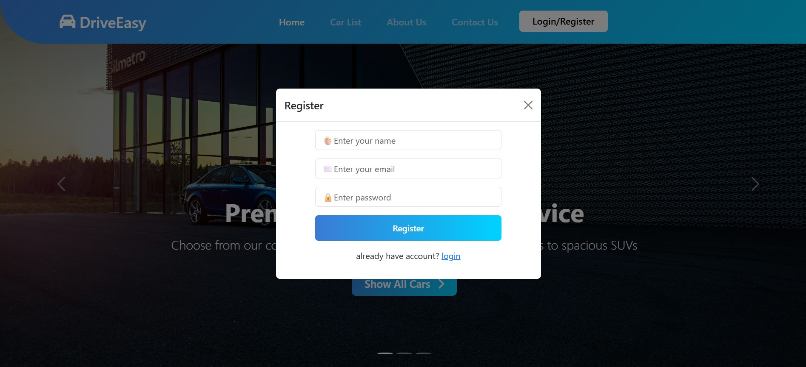

# 🚗 DriveEasy-Cars - Modern Car Rental System

 <!-- Replace with your actual image path -->

A responsive car rental platform with an admin dashboard, built using **Bootstrap 5**, **JavaScript**, and **Local Storage**.  
Designed to offer seamless rental experiences for customers and efficient fleet management for admins.

---

## ✨ Key Features

### 👥 Customer Experience
- 🔍 **Browse Cars**: Filter cars by type (Sedan, SUV, Coupe), price, and availability
- 🗓️ **Book Instantly**: Choose pick-up/drop-off date and time with a modern reservation form
- 🚫 **No Login Required**: Book cars as a guest using session storage
- 📋 **Booking History**: View past and current bookings stored locally

### 🛠️ Admin Dashboard
- 🚘 **Fleet Management**: Add, edit, or remove vehicles
- 📅 **Booking Oversight**: View and update booking statuses (confirmed, pending, canceled)
- 📊 **Visual Reports**: Display rental trends with **Chart.js**
- 👤 **User Management**: Monitor and manage user activities

### 🎨 UI & UX Highlights
- ✅ Fully responsive layout using **Bootstrap 5**
- 💬 Modal popups for login, booking, and alerts
- 🌑 Dark mode toggle
- ⚡ Optimized assets (e.g., WebP images, font icons)

---

## 🛠️ Technical Stack

| Component        | Technology                |
|------------------|---------------------------|
| Frontend         | HTML5, CSS3, JavaScript   |
| UI Framework     | Bootstrap 5               |
| Charts           | Chart.js                  |
| Icons            | Font Awesome 6            |
| State Handling   | Local & Session Storage   |

---

## 📺 Live Demo

🌐 [Check the Live Project Here](https://abdallaskar.github.io/DriveEasy-Cars/)) <!-- Replace with your actual link -->

---
🧑‍💻 Contributors
   Abdalla Skar 


### Clone the Repository:
```bash
git clone https://github.com/abdallaskar/DriveEasy-Cars
cd DriveEasy-Cars
